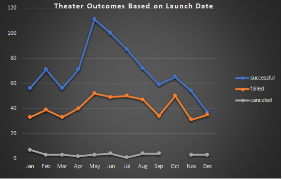
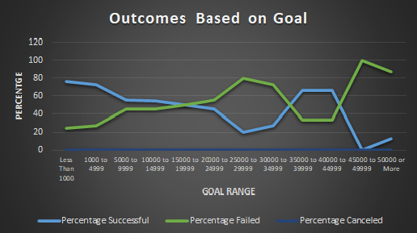

# Kickstarting with Excel: Analysis of Kickstarter Campaigns.
## Overview of Project.
We are helping Louise understand other campaigns’ outcomes based on their launch dates and their funding goals. We want to provide Louis with some key factors to make her fundraising campaign successful.
## Analysis and Challenges.
### Analysis of Outcomes Based on Launch Date.
This analysis was generated from the Kickstarter sheet, we created a new column titled “Years” in which we use the YEAR() function to shrink a lot of the data given and combine it. We focused on the Theater category since that is what Louise is interested in. We created a PivotTable and filtered by “Parent Category”, then put “Date Created Conversion” in Rows, and Outcomes in “Columns” and “Values”. This helped us create a PivotChart visualizing the performance of campaigns based on the month they were launched in.

### Analysis of Outcomes Based on Goals.
In order to provide Louise with this analysis, we were instructed to create a new worksheet in which we used a new function COUNTIFS() tp determine the number of successful, failed and canceled campaigns based on the dollar goal initially assigned. Once we created our table showing also the percentage for each successful, failed or canceled campaign, we were able to understand that the smaller campaigns with a goal of less than $1000 had the highest success rate, while the $1000 to $4999 had the most projects and campaigns as well as the second highest success rate.

### Challenges and Difficulties Encountered.
The main challenge I encountered was while working with the COUNTIFS function while working on the Outcomes based on Goals, this is a function I was not used to but thankfully it was very helpful in understanding the data and making it much simpler once I was able to display in a chart. I also made a mistake at first when trying to create the Outcomes Based on Goal chart, I tried to create a PivotTable first then include all the information in the PivotTable Field, then I realized I could go straight to Insert Tab and build the chart from there instead.

## Results

### What are two conclusions you can draw about the Outcomes based on Launch Date?
During most of the year the number of successful campaigns is significantly higher than the failed ones, the average percent of successful campaigns was around 62%, except for the month of December, where it dropped to 49%, during December we also had the least number of campaigns launched, which is a good sign to avoid launching campaigns during this time of the year. On the other hand, the month of May has the highest number of successful campaigns with 111 successful campaigns out of 166, a 67% success rate. May seems to be the best month to consider for a fundraiser campaign to be launched.

### What can you conclude about the Outcomes based on Goals? 
This analysis covered 1047 projects and their success rate based on the $ amount set for their goal, it covers the goals per range. The best results were achieved with a goal of less than a $1000, with a 76% success rate. The range of 1000 to 4999 came second with a 73% success rate, but it was out of 534 campaigns, and 388 of those campaigns were successful. So a project with a goal between $1000 and $4999 is very popular and many organizers seem to be working on projects within that range.

### What are some limitations of this dataset? 
I am not sure I noticed any limitations to the dataset.

### What are some other possible tables and/or graphs that we could create?
There are several other tables we could create and work with, for example one that’s based on the number of backers, the average donation, or the percentage funded for the project.

